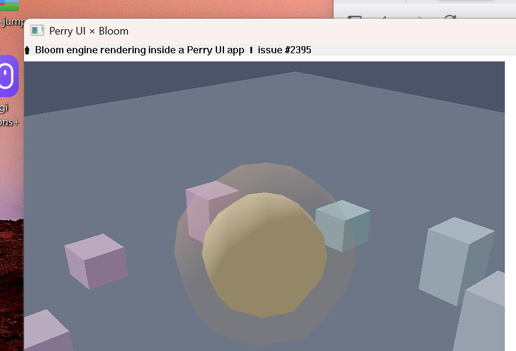

# Bloom × Perry UI — embedded render view (issue #2395)

A normal Perry UI app that embeds the Bloom game engine as a live render view
(`BloomView`), the way the issue asks for — "a BloomView that renders a Bloom
scene directly inside a Perry UI app", similar to Flame inside Flutter.



## How it works

`BloomView(width, height)` is a Perry UI widget that reserves a native child
window in the view tree. Perry UI does **not** link or know about Bloom — it
only owns the window and exposes its handle:

```ts
import { App, VStack, Text, BloomView, bloomViewGetHwnd } from 'perry/ui';
import { attachToHwnd, beginDrawing, endDrawing, clearBackground, /* … */ } from 'bloom';

const view = BloomView(820, 480);

let attached = 0;
setInterval(() => {
  if (!attached) { attachToHwnd(bloomViewGetHwnd(view), 820, 480); attached = 1; }
  beginDrawing();
  clearBackground({ r: 18, g: 22, b: 34, a: 255 });
  // …draw a 3D scene…
  endDrawing();
}, 16);

App({ title: "Perry UI × Bloom", width: 880, height: 600,
      body: VStack(10, [Text("…"), view]) });
```

User TypeScript hands the `BloomView`'s HWND to Bloom via `attachToHwnd`. Bloom
builds its wgpu (DX12/Vulkan) surface on that window, subclasses it for
resize/input, and renders into it. The host (Perry UI) owns the message loop, so
the app drives Bloom's frame loop itself (`beginDrawing` → draw → `endDrawing`)
from a `setInterval` tick — `runGame` is not used (it would block).

This keeps `perry-ui-windows` free of any Bloom dependency: apps that never call
`BloomView` pull in nothing extra.

## Build & run (Windows)

```bash
PERRY=/path/to/perry-with-bloomview/perry.exe ./build-windows.sh --run
```

Currently implemented on the Windows target.
